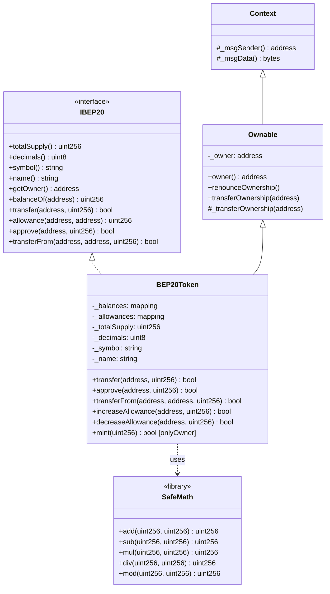
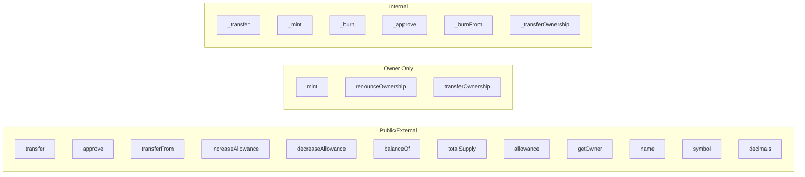
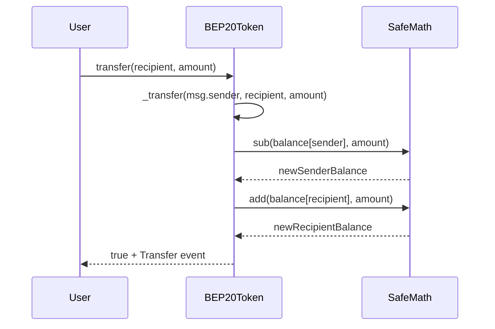
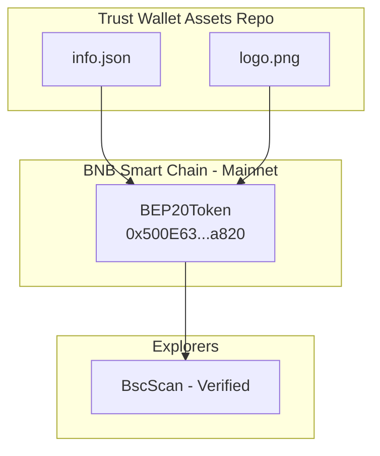

# Architecture — LPS Token (BEP20)

## Overview



## Contract Details

| Property | Value |
|----------|-------|
| **Name** | Luxury Property Solutions LLC |
| **Symbol** | LPS |
| **Decimals** | 18 |
| **Initial Supply** | 10,000,000,000 (10 billion) |
| **Max Supply** | Unlimited (owner can mint) |
| **Compiler** | Solidity 0.5.16 |
| **License** | MIT |
| **Chain** | BNB Smart Chain (ChainID: 56) |
| **Address** | `0x500E63135fC1899E6342815C8adA406c0775a820` |

## Inheritance Chain

```
Context
  └── Ownable
       └── BEP20Token (implements IBEP20)
              └── uses SafeMath (library)
```

## Storage Layout

| Slot | Variable | Type | Access |
|------|----------|------|--------|
| 0 | `_owner` | address | Ownable (private) |
| 1 | `_balances` | mapping(address => uint256) | private |
| 2 | `_allowances` | mapping(address => mapping(address => uint256)) | private |
| 3 | `_totalSupply` | uint256 | private |
| 4 | `_decimals` | uint8 | private |
| 5 | `_symbol` | string | private |
| 6 | `_name` | string | private |

## Function Visibility Map



## Data Flow



## Deployment Architecture



## Security Boundaries

| Boundary | Protection |
|----------|-----------|
| Token transfers | Balance checks via SafeMath |
| Allowance spending | Allowance checks via SafeMath |
| Minting | `onlyOwner` modifier |
| Ownership transfer | `onlyOwner` + zero-address check |
| Overflow/Underflow | SafeMath library (all operations) |

## Dependencies

- **No external contract calls** — fully self-contained
- **No oracle dependencies** — no price feeds
- **No proxy/upgradeability** — immutable deployment
- **No external libraries** — SafeMath is inlined

## File Structure

```
contracts/
└── BEP20Token.sol          # Deployed contract source (verified on BscScan)

test/
├── BEP20Token.test.js      # Unit tests (Hardhat/ethers.js)
└── BEP20Token.integration.js  # Integration tests

scripts/
└── deploy.js               # Deployment script (reference only - already deployed)

docs/
├── SECURITY_AUDIT.md       # Security findings
├── ARCHITECTURE.md         # This file
├── DEPLOYMENT_GUIDE.md     # Deployment instructions
└── TEST_REPORT.md          # Test results
```
